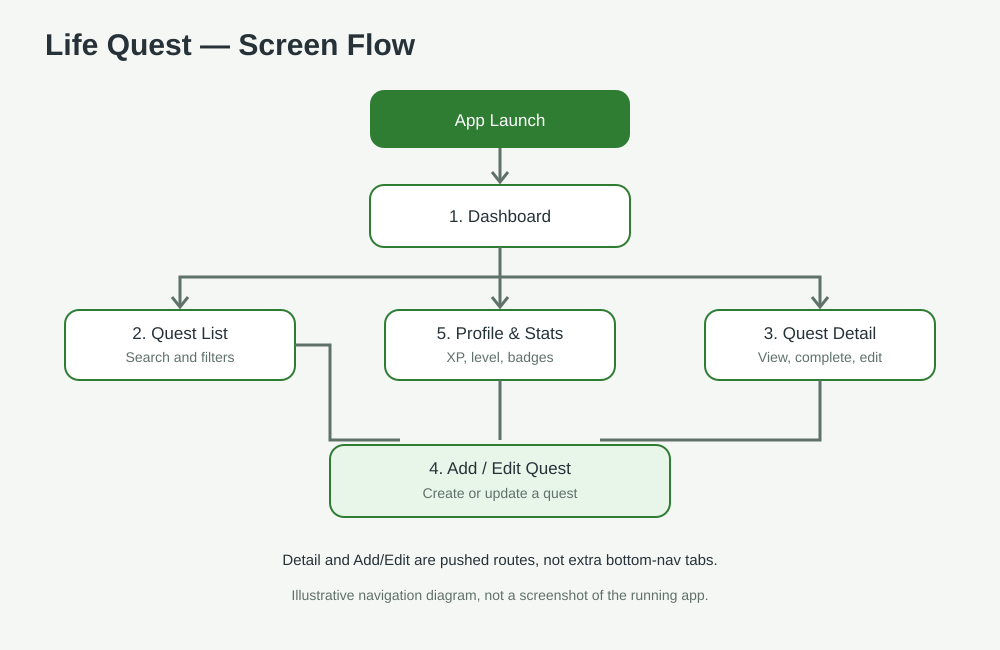

# Mockup and wireframes

Life Quest follows the approved Version 2 scope: five main screens, with Add/Edit Quest serving both create and edit tasks. No extra settings or social screens are added to the MVP.

## Mockup

The original approved mockup image/PDF was not included in the supplied archives. The flow diagram below is a documentation aid, not a replacement for the approved Figma mockup. Add the original approved export if available.



## Wireframes and screen flow

The original wireframe images were not included in the supplied archives. The screen-flow diagram below documents navigation but is not presented as a high-fidelity wireframe. Add the original wireframe export if available.

```text
App launch
   |
Dashboard  <------------------------------+
   |                                      |
   +--> Quest List --> Quest Detail       |
   |          |             |             |
   |          +--> Add/Edit -+             |
   |                        |             |
   +--> Add Quest ----------+             |
   |                                      |
   +--> Profile & Statistics -------------+
```

Bottom navigation switches between Dashboard, Quest List, and Profile & Statistics. Quest cards open Quest Detail. The add action opens Add/Edit Quest; saving returns the created or edited quest to shared app state.

## Screens

### 1. Dashboard

Shows a welcome message, overall quest progress, XP/level information, recent quests, achievement progress, and a quick action to create a quest. “See all” opens Quest List; selecting a quest opens Quest Detail.

### 2. Quest List

Shows saved quests and provides search, category, and status filters. Selecting a quest opens its detail. The add action opens Add/Edit Quest.

### 3. Quest Detail

Shows the selected quest’s title, category, description, target date, status, and reward. The user can edit it, mark it complete with a completion date and journal note, or delete it.

### 4. Add/Edit Quest

A shared form for a new or existing quest. It collects the title, category, description, and target date. In edit mode, existing values are loaded into the fields.

### 5. Profile & Statistics

Shows the user's display name, level, XP, quest totals/completion progress, and achievement badges. The user can update the display name.

## Implementation note

The source implementation has three bottom-navigation destinations (Dashboard, Quest List, Profile & Statistics) and opens Quest Detail and Add/Edit Quest as pushed routes. This implements the five approved screens without adding more top-level navigation items.
