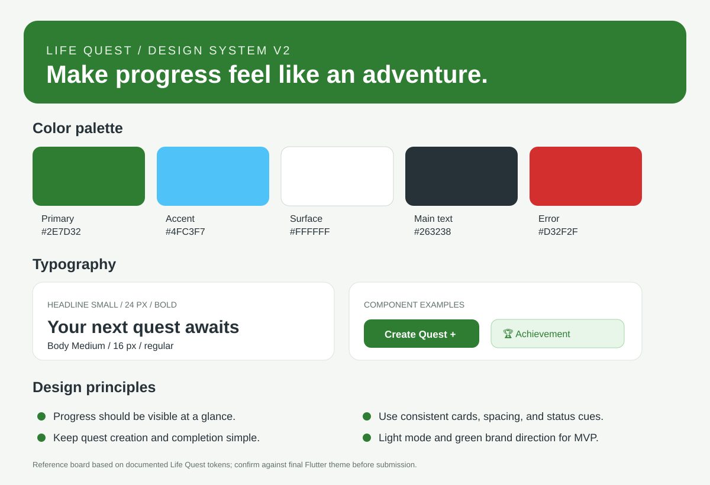

# Design system — Life Quest

The implementation uses a Material 3 theme generated from the Life Quest green seed color. A reference visual board is included below and at `docs/assets/design-system-board.svg`. It is a documentation graphic based on the written tokens, not an export from the original Figma file. Compare it with `lib/theme.dart` and update it if the implementation differs.

## Palette

| Token / role | Value | Use |
| --- | --- | --- |
| Primary seed | `#2E7D32` | Brand green; `ColorScheme.fromSeed` |
| Accent | `#4FC3F7` | Adventure/category accent |
| Background | `#F5F7F5` | Light app background |
| Surface | `#FFFFFF` | Cards and surfaces |
| Error | `#D32F2F` | Error/destructive states |
| Main text | `#263238` | Body text |
| Fitness category | `#2E7D32` | Fitness quest accent |
| Travel category | `#F9A825` | Travel quest accent |
| Learning category | `#7E57C2` | Learning quest accent |
| Personal category | `#EC407A` | Personal quest accent |

**Theme decision:** light mode for the MVP. Theme configuration is centralized in `lib/theme.dart`; category colors are defined with the quest category model.

## Type scale

| Text role | Specification | Use |
| --- | --- | --- |
| `headlineSmall` | 24 px, bold | Screen/section headings |
| `bodyMedium` | 16 px, regular | Main body copy and descriptions |
| `labelSmall` | 12 px, medium | Captions and compact labels |
| Supporting text | Material 3 defaults where not overridden | Labels and secondary content |

## Spacing

Use a consistent spacing scale based on 8 px increments where practical, with 8, 16, and 24 px as primary values. Widget-level padding and gaps are applied in screen and reusable widget files. A future cleanup could centralize every spacing value into an `AppSpacing` constants class; this is not claimed as already implemented.

## Components

| Component | File | Responsibility | Used by |
| --- | --- | --- | --- |
| Quest card | `lib/widgets/quest_card.dart` | Quest summary and tap callback | Dashboard, Quest List |
| Primary button | `lib/widgets/primary_button.dart` | Reusable action button | Forms and actions |
| Achievement card | `lib/widgets/achievement_card.dart` | Achievement and unlocked state | Dashboard, Profile |
| XP progress bar | `lib/widgets/xp_progress_bar.dart` | Current XP/level progress | Dashboard, Profile |
| Status chip | `lib/widgets/status_chip.dart` | Quest status | Quest cards/detail |
| Search bar | `lib/widgets/app_search_bar.dart` | Search input and callback | Quest List |
| Bottom navigation | `lib/widgets/bottom_navigation.dart` | Selected destination and callback | App shell |
| Empty state | `lib/widgets/empty_state.dart` | Empty message and optional action | Dashboard, Quest List |
| Shared theme | `lib/theme.dart` | Central Material theme | Entire app |

## Changes since the last version

- Centralized theme configuration and used a Material 3 `ColorScheme.fromSeed` approach.
- Kept the original green brand direction and light-mode decision.
- Implemented reusable quest, status, achievement, progress, search, navigation, empty-state, and primary-button widgets.
- The visual board and full spacing-constant refactor remain follow-ups rather than being claimed complete.
